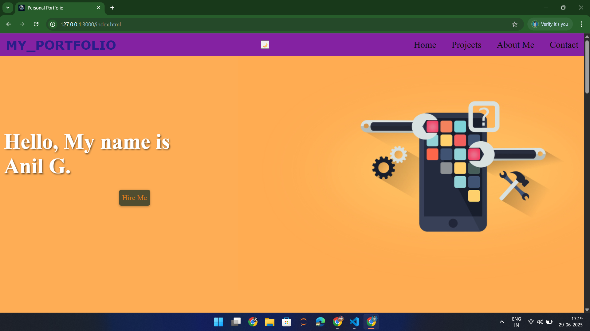

# 💖 My Personal Portfolio Website

Welcome to **MY_PORTFOLIO**, a fully responsive, modern, and interactive personal portfolio website designed and built from scratch using HTML, CSS, and JavaScript. This website showcases my projects, skills, and contact information — everything a frontend developer needs to present themselves professionally online.

 <!-- Replace with your actual screenshot -->


---

## ✨ Features

- 🎨 **Modern Design**: Clean, vibrant, and professional layout.
- 📱 **Fully Responsive**: Works seamlessly on mobile, tablet, and desktop devices.
- 🖼️ **Dynamic Projects Section**: Highlights personal projects with images, descriptions, and GitHub links.
- 📜 **About Me**: Short introduction with resume download.
- 📩 **Contact Section**: Displayed email, phone numbers, and location.
- 🌐 **Social Links**: Direct links to Instagram, GitHub, and LinkedIn profiles.
- 🌗 **Theme Toggle Ready**: Dark mode toggle button (implementation pending).
- 🎥 **AOS Animations**: Smooth scroll-based animations for engaging UX.

---

## 🛠️ Technologies Used

- **HTML5**: Page structure and semantic layout.
- **CSS3**: Styling, animations, and responsive design.
- **JavaScript**: Interactivity and dynamic elements.
- **AOS Library**: Animate on scroll effects.

---

## 📝 How to Use

1. **Clone the repository** :
   ```bash
   git clone https://github.com/AnilHubb/Portfolio
     ```

2. **Navigate into the project directory** :
   ```bash 
   https://github.com/AnilHubb/Portfolio
   ```
3. **Open index.html in your browser** :
    ```bash
    start index.html
    ```


   
---

## 🙌 Thank You

Thank you for taking the time to check out my portfolio! I hope you enjoyed exploring my work. If you have any feedback, opportunities, or just want to connect, feel free to reach out — I’d love to hear from youuuuu 🚀!!
